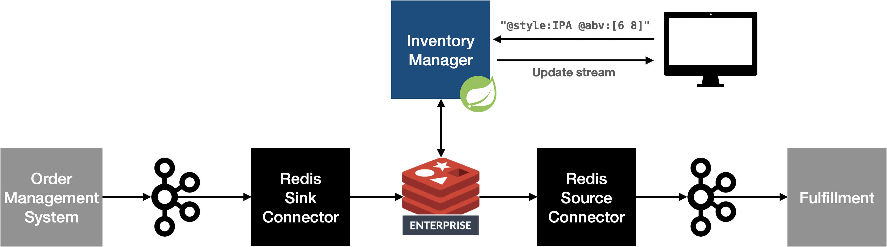

= Brewdis
:linkattrs:
:project-owner:   redis-field-engineering
:project-name:    brewdis
:project-group:   com.redis
:project-version: 0.2.1

image:https://github.com/{project-owner}/{project-name}/actions/workflows/early-access.yml/badge.svg["Build Status", link="https://github.com/{project-owner}/{project-name}/actions/workflows/early-access.yml"]

Real-Time Inventory demo using Redis.

== Run the demo

[source,shell]
----
git clone https://github.com/redis-field-engineering/brewdis.git
cd brewdis
./run.sh
----

=== Confluent Center

http://localhost:9021

=== Brewdis UI

http://localhost

=== Tableau

See setup instructions at https://github.com/redis-field-engineering/redis-sql

== Architecture

Brewdis consumes inventory demand events from Kafka and publishes inventory updates to Kafka using the Redis Kafka Connector.

Inventory state is maintained in real-time by Redis in the `inventory` index.

Product catalog and inventory can be queried in RediSearch directly or in Tableau via the https://github.com/redis-field-engineering/redis-sql[Trino integration].

== Resources

=== RediSearch

Full-text search and secondary-indexing engine based on Redis.

https://redis.com/modules/redis-search/

=== Redis Kafka Connect

Kafka Connector (Source and Sink) for Redis.

https://github.com/redis-field-engineering/redis-kafka-connect

=== Redis SQL

Trino Plugin for RediSearch

https://github.com/redis-field-engineering/redis-sql

