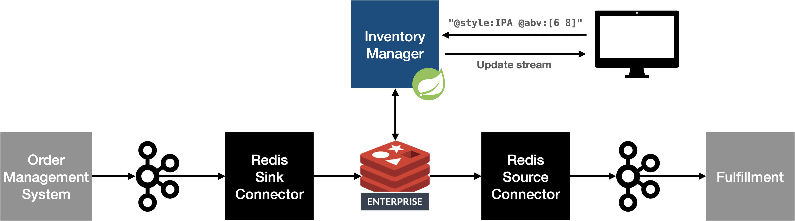

= Brewdis
:linkattrs:
:project-owner:   redis-field-engineering
:project-name:    brewdis-kafka
:project-group:   com.redis
:project-version: 0.2.0

image:https://github.com/{project-owner}/{project-name}/actions/workflows/early-access.yml/badge.svg["Build Status", link="https://github.com/{project-owner}/{project-name}/actions/workflows/early-access.yml"]

Fork of https://github.com/redis-developer/brewdis[Brewdis] that uses the https://github.com/redis-field-engineering/redis-kafka-connect[Redis Kafka Connector] to consume inventory demand events from Kafka and publish inventory updates to Kafka.

== Architecture

{empty} +

{empty} +

== Run the demo

[source,shell]
----
git clone https://github.com/redis-field-engineering/redis-kafka-connect.git
git clone https://github.com/redis-field-engineering/brewdis-kafka.git
cd brewdis-kafka
./run.sh
----

* Confluent Center: http://localhost:9021
* Brewdis UI: http://localhost:8080
